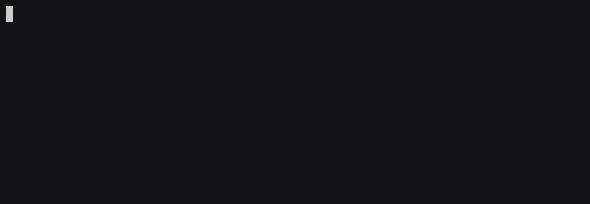

**Those images are generated from the functional tests**

## test_cat

## test_cat_home

## test_docker

## test_git

## test_insmod

## test_insmod_home

## test_options

## test_vi

## test_vi_home

